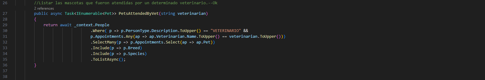

# Veterinary-Campus
# Desarrollo Backend NetCore Filtro Final

## Introducción al Proyecto de Administración de Veterinaria

El proyecto de desarrollo de software tiene como objetivo principal la creación de un sistema de administración para una veterinaria. Este sistema permitirá a los administradores y al personal de la veterinaria gestionar de manera eficiente y efectiva todas las actividades relacionadas con la atención de mascotas y la gestión de clientes.

El sistema contará con diferentes módulos que abarcarán áreas clave como el registro de pacientes, la programación de citas, el seguimiento de tratamientos médicos, la gestión de inventario de medicamentos y productos, así como la generación de reportes y estadísticas relevantes para la toma de decisiones.

El desarrollo se realizará utilizando la tecnología NetCore Version 7.0, que proporciona un entorno robusto y escalable para la creación de aplicaciones web. Se implementarán las mejores prácticas de desarrollo de software para garantizar la calidad y fiabilidad del sistema.

El proyecto de administración de veterinaria tiene como objetivo mejorar la eficiencia y la experiencia del cliente, al tiempo que facilita la gestión interna de la veterinaria. Se espera que este sistema contribuya positivamente al crecimiento y éxito del negocio.

## Contexto

La solucion a este proyecto se modicó ligeramente para eliminar el duplicado de entidades, por lo tanto, se tiene una sola entidad(Person) que engloba a :
 - Proovedor
 - Veterinario
 - Propietario

Para manejar el tipo de persona se a creado una entidad llamada PersonType la cual se va a encargar de establecer el tipo a la persona. Como Veterinario tiene una propiedad especial llamada Especialidad, decidí crear una tabla especialidad que liga a persona en general, por ende este campo puede ser null, ya que, no todas las personas tienen esa propiedad (Especialidad).   

Este proyecto se ha desarrollado con Csv, por ende, cuando se haga dotnet run, debería cargarse los datos a la bd de manera automatica


# Consultas

## Grupo A

 ### Crear un consulta que permita visualizar los veterinarios cuya especialidad sea X.
 ### Logica Peticion

 ### Peticion Thunder
 ```
Ruta =  API/Veterinarian/GetByEspeciality/Cirujano vascular
 ```


## Listar los medicamentos que pertenezcan al laboratorio X
### Logica Peticion

 ### Peticion Thunder
 ```
Ruta = API/Product/GetByLab/Genfar
```


## Mostrar las mascotas que se encuentren registradas cuya especie sea X.
### Logica Peticion

 ### Peticion Thunder
```
Ruta = API/Pet/GetOwnerPetByBreed/golden retriver
```


## Listar los propietarios y sus mascotas.
### Logica Peticion

 ### Peticion Thunder
```
Ruta = API/Owner/GetAllOwnersAndPets
```


## Listar los medicamentos que tenga un precio de venta mayor a X
### Logica Peticion

 ### Peticion Thunder
```
Ruta = API/Product/GetGreaterThan/50000
```


## Listar las mascotas que fueron atendidas por motivo de X en el X trimestre del 2023/X
### Logica Peticion  

 ### Peticion Thunder
```
Ruta = API/Pet/GetByReasonInTrimYear/3/2023/vacunacion
```

## Grupo B
## Listar todas las mascotas agrupadas por especie.
### Logica Peticion  

 ### Peticion Thunder
```
Ruta = API/Species/GetPetGroupedBySpecies
```


## Listar todos los movimientos de medicamentos y el valor total de cada movimiento.
### Logica Peticion  

 ### Peticion Thunder
```
Ruta = API/ProductMovement/GetProductMovementAndVal
```


## Listar las mascotas que fueron atendidas por un determinado veterinario.
### Logica Peticion  

 ### Peticion Thunder
```
Ruta = API/Veterinarian/PetsAttendedByVet/Carlos
```


## Listar los proveedores que me venden un determinado medicamento.
### Logica Peticion  

 ### Peticion Thunder
```
Ruta = API/Supplier/GetSuppliersByProduct/Dopamina
```

## Listar las mascotas y sus propietarios cuya raza sea X
### Logica Peticion  

 ### Peticion Thunder
```
Ruta = API/Pet/GetOwnerPetByBreed/Golden retriver
```


## Listar la cantidad de mascotas que pertenecen a una raza a una raza. Nota: Se debe mostrar una lista de las razas y la cantidad de mascotas que pertenecen a la raza.
### Logica Peticion  

 ### Peticion Thunder
```
Ruta = API/Breed/GetPetCountInBreed
```


```
```
Para el crud exceptuando los get no  usan Dto, se basen en la entidad original, aunque el el swagger se muestre algo así

en realidad solo hay que pasarle los atributos y la foranea como esto:

